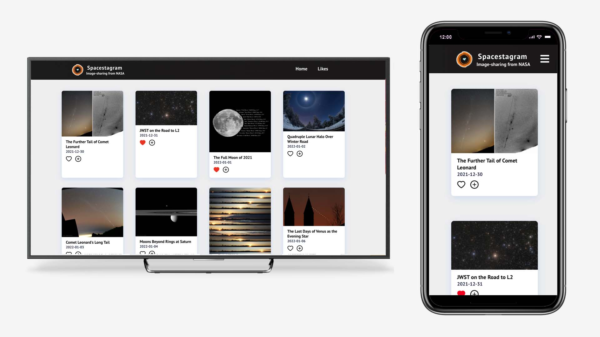

# Spacestagram

A responsive website to share and manage images from NASA API.

## About/Overview

The project requires to build an app to help share photos from one of NASA's image APIs. To satisfy users using different devices, this app is made as a responsive website, which can perfectly show the photos no matter the length of the width of the device.

The live version of this app is https://lucaspanwang.github.io/spacestagram/

Feel free to browse it with any device you like.

## List of Features

1. Postings of images from NASA API and corresponding information will **display respontively** according to the width of the device.
2. The user can choose different page on the **nav bar**. The status of the nav bar will also change according to the width of the browser.
3. Users can click the **[heart] icon** to like or unlike an image. The [heart] icon will turn red if this image is liked.
4. The app will **save likes** if the user leaves or reloads the page.
5. There is a **Likes brand page** for users to see what images have they liked. If they unlike an image in this page, the image will be eliminated.
6. The user can click the **[plus] button** to show more information about the photos. Similarly, they can click the **[minus] button** to hide the expanded text.

## Technologies choices

This project is mainly built with **JavaScript**, **React**, **Hooks** and **Ant Design**.

The **responsive feature** of the website is mainly developed with **Flex-Layout** and **CSS @media Rules**.
